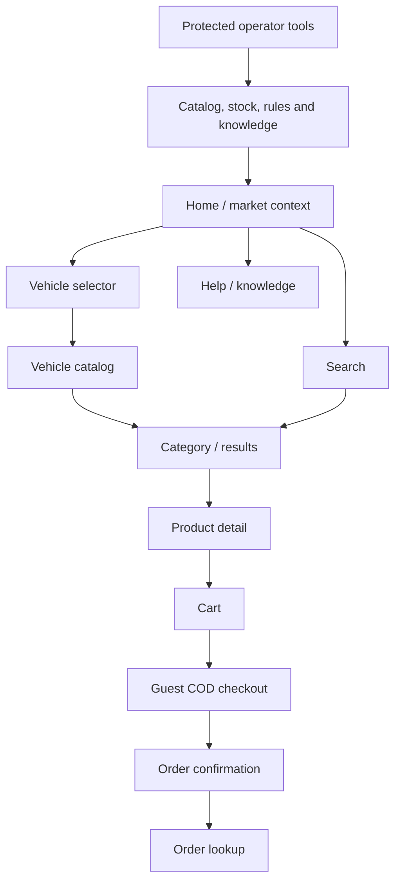

# Product Vision and Scope

## Vision

MG Parts is a safe, deterministic learning application where customers can find MG parts that fit a selected vehicle and place a cash-on-delivery order, while testing teams can exercise UI, API, data, multilingual, RAG and autonomous-agent workflows against known ground truth.

## Objectives

1. Deliver an end-to-end anonymous commerce path in English and Arabic for Egypt and the UK.
2. Provide enough catalog and rule complexity to produce meaningful functional, exploratory and agentic tests.
3. Make the application reproducible: every environment can be reset to a named fixture version.
4. Make decisions observable through correlation IDs, audit events and explainable price/fitment/search outputs.
5. Provide a versioned knowledge corpus and evaluation set for RAG testing.

## Success measures

| Measure | MVP target |
|---|---|
| Critical journey completion | Browse/search → cart → COD order succeeds in both markets and languages. |
| Translation completeness | 100% of customer-facing keys have English and Arabic values; no fallback key is visible. |
| Price reproducibility | A fixture version and FX snapshot produce identical totals across UI and API. |
| Accessibility | No critical WCAG 2.2 AA automated violations on critical pages; keyboard completion is possible. |
| API contract | OpenAPI validation passes for all public and test-support endpoints. |
| Test reset | Authorized non-production reset completes within 60 seconds and returns the fixture checksum. |
| RAG grounding | Golden-set answers cite valid chunk IDs; unsupported-answer cases abstain. |
| Traceability | Every MVP user story maps to requirements and acceptance criteria. |

## Personas

| Persona | Need |
|---|---|
| Egyptian MG owner | Arabic/English discovery, EGP prices, locally understandable address fields and cash delivery. |
| UK MG owner | English discovery, GBP prices, UK address validation and cash delivery. |
| Independent mechanic | Fast part-number search, compatible vehicles, alternatives and technical details. |
| Catalog operator | Manage fixture products, fitment, stock, prices and knowledge documents. |
| Test engineer | Stable selectors, APIs, resettable data, event evidence and seeded edge cases. |
| AI quality engineer | Ground-truth documents, retrieval metadata, citations, eval cases and deterministic tool behavior. |

## MVP scope

### Included

- Market, language and display-currency switching.
- Full Arabic right-to-left and English left-to-right rendering.
- MG model/year/engine selection using seeded fitment data.
- Catalog categories, search, filters, sorting and pagination.
- Product detail with references, variants, price, stock, fitment, quantity rules, alternatives and related products.
- Anonymous persistent cart.
- Guest checkout and cash-on-delivery order placement.
- Configurable dummy shipping and tax rules for both markets.
- Order confirmation and lookup by order reference plus verification value.
- Minimal operator interface or protected API for product, stock, rule and knowledge fixtures.
- OpenAPI specification, structured events, correlation IDs, stable test IDs and non-production reset.
- RAG-ready English/Arabic knowledge corpus and a golden evaluation set.

### Deferred

- Customer registration, login, saved vehicles and order history.
- Real VIN decoding or manufacturer catalog integration.
- Online payment, refunds and payment-provider webhooks.
- Live FX, tax, address, carrier or stock integrations.
- Promotion engine, coupons and loyalty.
- Returns, warranty claims and customer-service case management.
- Reviews, discussion, newsletter and product-question forms.
- Production use of MG logos, proprietary catalogs or copied Skoda content.

## Representative fixture scope

The MVP should seed 4–6 MG models spanning both markets, 8–12 categories, 80–120 logical products and 120–180 variants. The dataset must include:

- genuine, OE-equivalent and aftermarket variants;
- in-stock, low-stock, out-of-stock and discontinued states;
- exact fit, incompatible and ambiguous-fit examples;
- part supersession and alternative relationships;
- products sold singly, in pairs and in increments;
- light, heavy and oversize shipping examples;
- missing Arabic translation and stale-knowledge records in a separate negative-test fixture, never the default fixture.

### Approved initial vehicle fixture

The initial synthetic families are MG3, MG4 EV, MG5, ZS, ZS EV and HS. They use representative demonstration year/engine variants scoped to Egypt and the UK. These records exist for repeatable fitment tests and are not authoritative vehicle or safety guidance. Exact stable IDs and fitment combinations are finalized with F03 and F05.

## High-level sitemap

## Approved demonstration and publishing boundary

- The application is a learning/demonstration system and does not take real orders, real cash, payment credentials or real customer data.
- Seed shipping, tax, FX, price, stock and fitment values are fictional versioned configuration, not legal, commercial or safety advice.
- The public experience identifies itself as an unofficial educational demonstration and labels fictional data clearly.
- The project does not use an official MG logo, copied proprietary catalogs or copied commerce content.
- Interface copy and imagery are original or properly licensed generic assets. External assets require recorded provenance and license information.
- Public deployment uses Google Cloud Run with Neon PostgreSQL and must have cost controls and no persistent dependence on a container filesystem.
