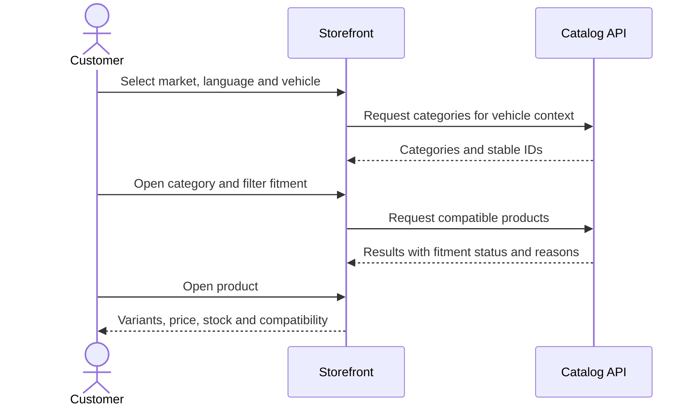
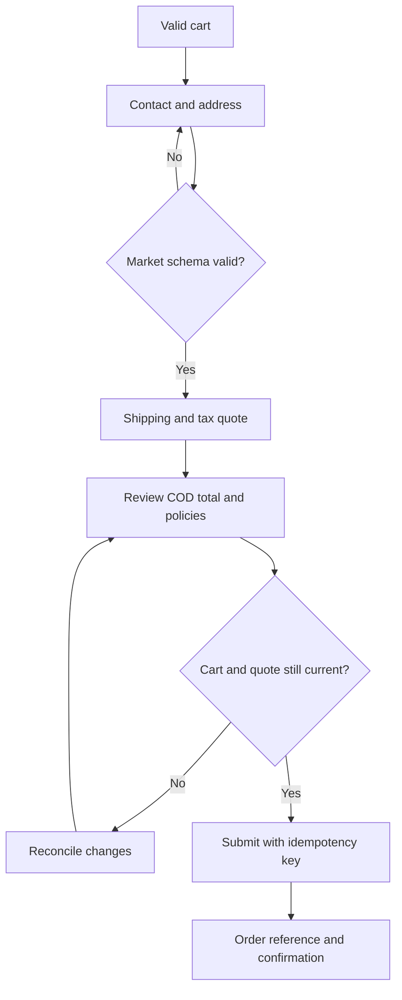

# User Journeys and Business Rules

## Journey J01 — Browse by vehicle

Main alternate paths:

- Model year has multiple engines: engine remains optional and fitment may be `AMBIGUOUS`.
- No compatible products: show an empty state and allow the user to broaden fitment.
- Vehicle changes while cart contains items: re-evaluate and flag affected lines without deleting them.

## Journey J02 — Search by part number or phrase

1. User enters an English/Arabic phrase or reference such as `MG 101-AB`.
2. System records original query and normalizes case, whitespace and hyphens.
3. System searches all vehicles or the selected vehicle scope.
4. User filters and sorts results.
5. System keeps query/filter state through pagination and locale changes.
6. Selecting a result opens a product page with a match reason available in diagnostics.

Main alternate paths: empty query, unsupported characters, no results, exact reference with incompatible vehicle and ambiguous Arabic synonym.

## Journey J03 — Add to cart and reconcile

1. User selects a sellable variant and quantity.
2. Server validates availability, quantity rules and current quote.
3. Server creates/updates the session cart and returns a new cart version.
4. User edits quantities or changes currency/language.
5. Before checkout, server re-quotes all lines.
6. If price, stock or fitment changed, user must accept the reconciled cart before continuing.

## Journey J04 — Guest cash-on-delivery checkout

No payment account or payment credentials are collected. A duplicate submission with the same idempotency key returns the same order rather than creating another order.

## Journey J05 — Order lookup

1. User enters order reference and configured verification value.
2. Service rate-limits and validates the pair.
3. A successful lookup displays non-sensitive order summary, total and status.
4. A failed lookup returns the same generic message for not-found and verification mismatch.

## Journey J06 — RAG evaluation

1. Test runner resets the environment to a fixture and knowledge version.
2. Runner submits a golden question with locale, market and expected evidence constraints.
3. Retrieval returns ranked chunks with stable IDs and scores.
4. Assistant answers with citations or abstains.
5. Evaluator checks retrieval recall, citation validity, faithfulness, answer policy and cross-language behavior.
6. Run artifacts record model/configuration, corpus version, fixture checksum and correlation IDs.

## Business rules

| ID | Rule |
|---|---|
| BR-001 | Market and display currency are separate concepts. Market controls eligibility, address, shipping and tax; currency controls display. |
| BR-002 | Egypt base currency is EGP and UK base currency is GBP. USD and EUR are display currencies only in the MVP. |
| BR-003 | FX rates are versioned fixture data; no live-rate service is called. |
| BR-004 | Prices are stored as integer minor units with ISO currency codes; binary floating point is not used for money. |
| BR-005 | Currency conversion follows one documented calculation and rounding order; order snapshots never recalculate historic totals. |
| BR-006 | The seeded tax rate may be zero because real policy is unknown, but the UI must identify it as demonstration configuration. |
| BR-007 | Seed shipping values are fictional. A rule contains market, zone, min/max weight, oversize flag, amount, currency and version. |
| BR-008 | Cash on delivery is the only payment method and is valid only where the selected shipping rule allows it. |
| BR-009 | A cart and order cannot contain variants belonging to different market catalogs when a variant is market-restricted. |
| BR-010 | Fitment is evaluated against product fitment records, not inferred from product description text. |
| BR-011 | `AMBIGUOUS` fitment means more vehicle information is required; it must not be displayed as compatible. |
| BR-012 | A superseded part may link to its replacement; a discontinued part is not sellable even if descriptive content remains available. |
| BR-013 | Quantity must satisfy `min <= quantity <= max` and `(quantity - min) mod increment = 0`. |
| BR-014 | Cart stock is not reserved. Final stock validation occurs atomically during order creation. |
| BR-015 | Order creation decrements stock once and emits one order-created event even when a client retries. |
| BR-016 | Price/stock/fitment changes are never silently accepted during checkout. |
| BR-017 | Order status starts at `PLACED_COD`; demonstration transitions may include `CONFIRMED`, `READY`, `DISPATCHED`, `DELIVERED` and `CANCELLED`. |
| BR-018 | Legal acceptance stores policy identifiers and versions, not only a Boolean. |
| BR-019 | Arabic and English share domain identifiers; translated labels never become keys or URL identity. |
| BR-020 | Knowledge retrieval filters unpublished, expired, wrong-market and wrong-locale documents before ranking. |
| BR-021 | When Arabic evidence is unavailable, an Arabic answer may use approved English evidence only if the response declares the language mismatch; default golden cases expect same-language evidence. |
| BR-022 | The assistant must not invent compatibility, price, stock, tax, delivery promise or order status. Dynamic facts must come from tools/APIs, not static RAG documents. |

## Market data assumptions

| Topic | Egypt | United Kingdom |
|---|---|---|
| Default locale | Arabic, switchable to English | English, switchable to Arabic |
| Default display currency | EGP | GBP |
| Address fixture | governorate, city/district, street, building, optional postcode | address lines, city, postcode |
| Phone fixture | accepts `+20` and normalized local examples | accepts `+44` and normalized local examples |
| Shipping/tax | Dummy versioned rules to be confirmed | Dummy versioned rules to be confirmed |
| Payment | Cash on delivery | Cash on delivery |

