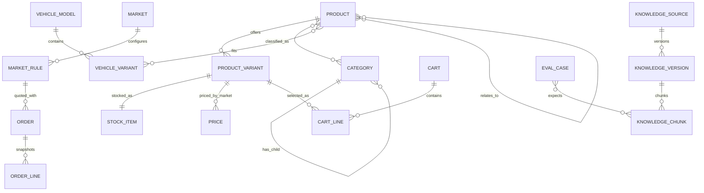

# Data Model and API Requirements

This document specifies a technology-neutral logical model. Storage and implementation technology are intentionally not prescribed.

## Core domain model



## Entity definitions

| Entity | Required fields/notes |
|---|---|
| Market | `code` (`EG`, `GB`), enabled locales/currencies, base currency, status. |
| Market rule | Type (`FX`, `TAX`, `SHIPPING`, `COD`), version, effective dates, structured payload, checksum. |
| Vehicle model | Stable ID, MG model name, market availability. |
| Vehicle variant | Model ID, year range, engine/trim codes and normalized attributes used for fitment. |
| Category | Stable ID, parent ID, sort order, localized name/description, status. |
| Product | Stable ID, localized content, reference numbers, specifications, category links, quantity rules, shipping attributes. |
| Product variant | SKU, product ID, manufacturer, part type, origin, status, images. |
| Fitment | Product ID, vehicle variant ID, constraints and explanation code. |
| Product relationship | Source/target product IDs and type: `ALTERNATIVE`, `SUPERSEDES`, `RELATED`. |
| Stock item | SKU, on-hand, available, status, version/concurrency token. |
| Price | SKU, market, base amount in minor units, currency, effective dates and version. |
| Cart | Opaque ID, market, locale, display currency, version, expiry. |
| Cart line | SKU, quantity, current quote snapshot, validation flags. |
| Order | Reference, status, contact/address snapshot, market/locale/currency, totals, rule versions, policy versions, idempotency key hash and timestamps. |
| Order line | Immutable product/SKU/name/reference/quantity/price/tax snapshot. |
| Knowledge source/version/chunk | Stable provenance and versioning fields defined by FR-080–FR-083. |
| Evaluation case | Question, locale, market, expected chunk IDs, answerability, prohibited claims and rubric. |

## Money and quote shape

Example fields, not a prescribed JSON naming convention:

```json
{
  "quoteVersion": "q-00042",
  "baseSubtotal": { "minor": 125000, "currency": "EGP" },
  "fxSnapshot": { "id": "fx-demo-2026-08-03", "rate": "1.000000" },
  "displaySubtotal": { "minor": 125000, "currency": "EGP" },
  "tax": { "minor": 0, "currency": "EGP", "ruleVersion": "tax-eg-demo-v1" },
  "shipping": { "minor": 0, "currency": "EGP", "ruleVersion": "ship-eg-demo-v1" },
  "grandTotal": { "minor": 125000, "currency": "EGP" },
  "isDemonstrationPolicy": true
}
```

Rates should use decimal strings or fixed-precision decimals. Monetary values use integer minor units.

## F01 implemented context and conversion contract

The market-context shell uses an anonymous servlet session with a 30-minute inactivity timeout. The initial context is Egypt, Arabic and EGP. A change to a different market applies that market's default language and display currency (`EG` → `ar`/`EGP`; `GB` → `en`/`GBP`). Re-selecting the already active market is idempotent and preserves explicit language/currency choices. Language-only and currency-only changes preserve every other context field.

Context updates use stable codes only: market `EG`/`GB`, locale `ar`/`en` and currency `EGP`/`GBP`/`USD`/`EUR`. Unsupported or free-text values produce a stable `CONTEXT_*_UNSUPPORTED` error. A `context.changed` event records the previous and active context, changed fields, schema and fixture versions, timestamp, correlation ID and causation ID so later vehicle/cart modules can revalidate dependent state without coupling to the web adapter.

F01's FX values are fictional deterministic fixtures, not financial data:

| Base | EGP | GBP | USD | EUR |
|---|---:|---:|---:|---:|
| EGP | `1.000000` | `0.015873` | `0.020000` | `0.018500` |
| GBP | `63.000000` | `1.000000` | `1.260000` | `1.165000` |

The implemented conversion boundary is:

```text
baseMajor = baseMinor / 10^baseCurrencyMinorDigits
unroundedDisplayMajor = baseMajor × fixedPrecisionRate
displayMinor = HALF_UP(unroundedDisplayMajor × 10^displayCurrencyMinorDigits)
```

No intermediate monetary value is rounded and binary floating point is not used. Quote responses expose the base amount/currency, `fx-demo-v1` snapshot ID and decimal-string rate, display amount/currency, `HALF_UP_AT_DISPLAY_MINOR_UNIT` method and the demonstration-data flag. The preview endpoint accepts `baseMinor` from 0 through 1,000,000,000; later product/cart features will own real quote composition from fixture prices.

## API capability map

| Method/path pattern | Purpose | Important behavior |
|---|---|---|
| `GET /api/v1/context` | Markets, locales and currencies | Returns active session context, explicit options, fixture/rounding configuration and a labeled deterministic preview. |
| `PUT /api/v1/context` | Change active context | Accepts any explicit subset of market, locale and currency; market changes apply documented defaults before explicit overrides. |
| `GET /api/v1/context/quote` | Demonstration FX preview | Converts a bounded base-minor-unit value using the active market base and display currency plus the versioned fictional FX table. |
| `GET /api/v1/vehicles` | Vehicle selector data | Filterable by market, model and year. |
| `GET /api/v1/categories` | Category tree | Supports vehicle and locale context. |
| `GET /api/v1/products` | Browse/search | Query, vehicle, category, filters, sort, pagination and diagnostics flag. |
| `GET /api/v1/products/{id}` | Product details | Includes variants, fitment, relations, price and stock. |
| `POST /api/v1/fitment/evaluate` | Explicit fitment check | Returns status and explanation code. |
| `POST /api/v1/carts` | Start anonymous cart | Returns opaque cart token and version. |
| `GET /api/v1/carts/{id}` | Get/requote cart | Never trusts client totals. |
| `POST /api/v1/carts/{id}/lines` | Add line | Validates SKU, quantity, stock and market. |
| `PATCH /api/v1/carts/{id}/lines/{lineId}` | Change quantity | Requires expected cart version. |
| `DELETE /api/v1/carts/{id}/lines/{lineId}` | Remove line | Idempotent delete. |
| `POST /api/v1/quotes/shipping` | Shipping/tax quote | Destination and cart attributes produce rule-versioned quote. |
| `POST /api/v1/orders` | Place COD order | Requires cart version, policy versions and idempotency key. |
| `POST /api/v1/orders/lookup` | Customer lookup | Generic failure response and rate limit. |
| `GET /api/v1/knowledge/search` | Testable retrieval | Returns chunks, ranks, filters and provenance. |
| `POST /api/v1/assistant/query` | Optional demo assistant | Returns answer, citations, tool facts and abstention status. |
| `POST /api/test-support/reset` | Non-production reset | Authorized, named fixture, checksum response. |
| `POST /api/test-support/scenarios` | Activate test fault/scenario | Time-bound and auditable. |

## Contract conventions

- Public identifiers are opaque and stable; database keys are not exposed accidentally.
- State-changing requests support a correlation ID and appropriate idempotency/concurrency token.
- Error bodies contain `code`, `message`, `correlationId`, optional field errors and safe diagnostic metadata.
- Localized messages are presentation aids; automation asserts machine-readable codes.
- Pagination returns stable ordering, page/cursor metadata and total count when economically feasible.
- Date/time values use ISO 8601 UTC, while the UI renders market-appropriate formats.
- APIs do not accept calculated price, tax, shipping, availability or fitment as authoritative client input.

## Representative error codes

`VALIDATION_FAILED`, `MARKET_UNSUPPORTED`, `LOCALE_UNSUPPORTED`, `CURRENCY_UNSUPPORTED`, `VEHICLE_INCOMPLETE`, `FITMENT_INCOMPATIBLE`, `FITMENT_AMBIGUOUS`, `SKU_NOT_SELLABLE`, `STOCK_CHANGED`, `PRICE_CHANGED`, `QUANTITY_RULE_VIOLATION`, `CART_EMPTY`, `CART_VERSION_CONFLICT`, `QUOTE_EXPIRED`, `ADDRESS_INVALID`, `SHIPPING_UNAVAILABLE`, `POLICY_VERSION_STALE`, `ORDER_LOOKUP_FAILED`, `RATE_LIMITED`, `KNOWLEDGE_EVIDENCE_INSUFFICIENT`.

## Data lifecycle and privacy

- Anonymous cart expiry: configurable; default test fixture 24 hours.
- Demonstration orders: purgeable by environment reset; never use real customer data.
- Logs mask contact/address data and idempotency secrets.
- Knowledge chunks must not contain personal data or copied proprietary catalog content without permission.
- Reset endpoints and fault controls are disabled outside non-production environments.
